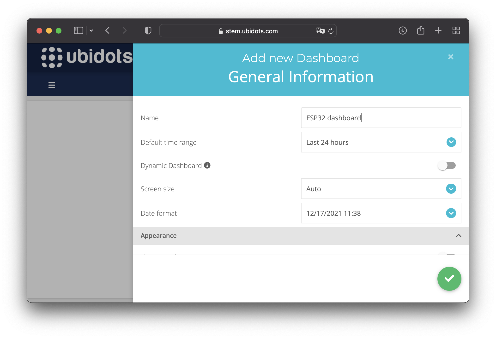

El módulo ESP32 de [Espressif Systems](https://www.espressif.com) (empresa con origen en Shangai) es un módulo basado en un MCU (*microcontroller unit*) de 32 bits que incluye un periférico de comunicación inalámbrica para la frecuencia de 2.4 GHz que habilita conectividad con redes Wi-Fi y Bluetooth. Los ESP32 DevKits son pequeñas placas de evaluación con módulos ESP32. El bajo precio de estas placas de evaluación (por debajo de los 10 €) y la posibilidad de programar los ESP32 con Arduino han hecho que la curva de dificultad para desarrollar aplicaciones IoT (*internet of thing*) sea mucho más suave y accesible haciendo que este módulo sea muy popular entre *makers* o para profesionales en fases de prototipaje. En la Figura 1 podemos ver una fotografía de una de estas placas de desarrollo y que se utilizará a lo largo de este documento.


Utilizaremos la placa de evaluación de la imagen para hacer una aplicación muy sencilla que permita controlar un actuador (en este caso un LED) desde una plataforma web llamada Ubidots a la vez que en esta misma plataforma visualizaremos los datos (en este caso la temperatura interna del módulo ESP32) recogidos por la placa de evaluación. Esto nos permitirá aprender cómo conectar el MCU a una red Wi-Fi y realizar una comunicación bidireccional con un servicio en la nube mediante el protocolo MQTT (ampliamente utilizado en el mundo IoT).

# Objetivos

- Conectar un módulo ESP32 a una red Wi-Fi.
- Publicar/suscribirse a *topics* mediante MQTT.
- Controlar actuadores en un módulo ESP32 desde una plataforma en la nube.
- Visualizar datos en una plataforma en la nube enviados por un módulo ESP32.

# Procedimiento

Para realizar el siguiente procedimiento necesitaremos:

- Una red Wi-Fi con acceso a internet a la que conectarnos.
- Arduino IDE.
- 1 x Placa de evaluación ESP32.
- 1 x Cable USB (si es tipo USB Micro B o USB C dependerá del modelo de placa que utilicemos).
- Una cuenta gratuita en Ubidots.

## Instalación de la placa de evaluación en Arduino IDE

Lo primero que necesitamos es instalar nuestra placa de evaluación en Arduino IDE para poderla programar. Para ello, abrimos Arduino IDE y vamos a `Archivo > Preferencias` y en el campo de texto "Gestor de URLs Adicionales de Tarjetas" ingresamos la siguiente dirección:

[https://raw.githubusercontent.com/espressif/arduino-esp32/gh-pages/package_esp32_index.json](https://raw.githubusercontent.com/espressif/arduino-esp32/gh-pages/package_esp32_index.json)


Clicamos en "Ok" para guardar la configuración y cerrar el formulario. A continuación, nos vamos a `Herramientas > Placa > Gestor de tarjetas...`. Escribimos "esp32" en el campo de búsqueda e instalamos la única opción que nos debería de aparecer.


Una vez instalada, podremos seleccionar nuestra placa en `Herramientas > Placa > ESP32 Arduino > ESP32 Dev Module`. Por último, con la placa ya conectada a nuestro ordenador con el cable USB, seleccionamos su puerto de comunicación en `Herramientas > Puerto`.

## Conectar el módulo ESP32 a una red Wi-Fi

Con la placa ya instalada y configurada, vamos a proceder a conectarnos a nuestra red Wi-Fi para después poder comunicarnos con la nube. Para ello, primeramente nos hemos de descargar la librería "esp32-mqtt". Esta librería en realidad sirve para realizar la comunicación con Ubidots mediante MQTT, pero también contiene la librería "WiFi". De este modo, podemos conectarnos a una red Wi-Fi con esta librería y ya la tenemos instalada para después implementar la comunicación MQTT.

Para instalar la librería, nos la descargamos de este [enlace](https://github.com/ubidots/esp32-mqtt/archive/main.zip) que podemos encontrar en su repositorio:

[https://github.com/ubidots/esp32-mqtt](https://github.com/ubidots/esp32-mqtt)

Una vez descargado el archivo `.zip`, vamos a Arduino IDE y clicamos en `Programa > Incluir Librería > Añadir biblioteca .ZIP...`. Seleccionamos el archivo `.zip` que acabamos de descargar. Una vez seleccionada, volvemos al menú `Programa > Incluir Librería`, pero esta vez seleccionamos "Ubidots MQTT for ESP32".

Esta librería depende de otra llamada "pubsubclient" para gestionar el protocolo MQTT. La podemos descargar de este [enlace](https://github.com/knolleary/pubsubclient/archive/master.zip) o bien desde su repositorio en GitHub:

[https://github.com/knolleary/pubsubclient](https://github.com/knolleary/pubsubclient)

Instalamos el `.zip` decargado tal y como hemos hecho con la libería anterior (pero esta vez no hace falta añadirla al código, puesto que la librería "esp32-mqtt" ya la incorpora).

Con esto ya hemos añadido todas las librerías que necesitaremos para realizar el resto de tareas.

Ahora vamos a conectarnos a la red Wi-Fi. Para ello, utilizaremos el siguiente código: 

```cpp
#include <UbiConstants.h>
#include <UbiTypes.h>
#include <UbidotsEsp32Mqtt.h>

const char *WIFI_SSID = "SSID of your Wi-Fi";
const char *WIFI_PASSWORD = "Password of your Wi-Fi";
const char *UBIDOTS_TOKEN = "Your Ubidots token";

Ubidots ubidots(UBIDOTS_TOKEN);

void setup() {

  Serial.begin(115200);
  Serial.println();
  Serial.println("Device initialization...");

  ubidots.connectToWifi(WIFI_SSID, WIFI_PASSWORD);

}

void loop() {

}
```

Lo primero que hemos hecho ha sido inicializar la comunicación serie para poder mostrar información a través del terminal/monitor serie. La hemos inicializado con un *baud rate* de 115200 bps. Seguidamente, nos conectamos a la red Wi-Fi configurada. La Wi-Fi la indicamos con las constantes `WIFI_SSID` y `WIFI_PASSWORD` de las líneas 5 y 6, respectivamente. Sustituye su valor con el SSID y la contraseña de la red Wi-Fi a la que quieras conectarte. De momento nos olvidamos de modificar la constante `UBIDOTS_TOKEN`. Compila el código y cárgalo en el MCU.

Abrimos el monitor serie en `Herramientas > Monitor Serie` y un *baud rate* de 115200 bps. Si todo ha funcionado correctamente, podremos ver en el terminal que el dispositivo se ha conectado a la red Wi-Fi con éxito.


## Crearse una cuenta en Ubidots

Ahora vamos a comunicarnos con Ubidots, pero primero debemos crearnos una cuenta gratuita. Vamos a su [página web](https://ubidots.com) y nos registramos. Una vez registrados, ingresamos con nuestro usuario y contraseña e iremos a la página principal donde aparecerán nuestros *dashboards*. Puesto que no tenemos ninguno todavía, nos aparece un botón "Add new Dashboard". Lo clicamos. Se nos abrirá un menú lateral donde indicaremos el nombre de nuestro *dashboard* y dejaremos el resto de los valores que vienen por defecto.



Una vez creado el *dashboard*, este se nos abrirá y nos aparecerá el botón "Add new Widget" con el que crear nuestros controles e indicadores.

## Controlar un LED desde Ubidots

### Configuración de Ubidots

Vamos a empezar con algo sencillo: encender/apagar un LED desde Ubidots. Para ello, primeramente, vamos a añadir nuestro dispositivo a Ubidots. Nos vamos a la sección "Devices" de Ubidots y ahí clicamos el botón "Create Device". Se nos despliega un menú lateral donde escogeremos "Blank Device". Seguidamente, le damos un nombre.


Una vez creado, el nuevo dispositivo aparece listado entre nuestros dispositivos disponibles. Ahora crearemos una variable llamada "LED" que utilizaremos para enviar el estado deseado para el LED de la placa ESP32. Cada vez que modifiquemos el valor de esta variable, se enviará un mensaje con su valor. Desde el MCU leeremos este nuevo valor de la variable y la aplicaremos a nuestro LED.

Para crear la variable, entramos en nuestro recién creado dispositivo y clicamos en el botón "Add Variable". Seleccionamos que sea del tipo "Raw" y la nombramos "LED". Si entramos a la recién creada variable, veremos su "API Label" que necesitaremos durante la programación del MCU para suscribirnos a ella. Si no la modificamos, esa "API Label" es "led".


Ahora ya solo nos falta añadir esta variable a nuestro *dashboard* para poder cambiar su valor desde la interfaz web. En el *dashboard* que acabamos de crear añadimos un *widget*. Este *widget* es el de tipo *Switch*.


Añadimos la variable que acabamos de crear y le damos al *widget* el nombre "LED".


Con esto ya tenemos nuestro *dashboard* listo para publicar el valor de la variable LED cada vez que pulsemos el interruptor de la interfaz web.


### Programación del microcontrolador

Ya tenemos una cuenta en Ubidots, hemos añadido el dispositivo a la cuenta, hemos creado una variable LED asociada al dispositivo y hemos añadido un *widget* a nuestro *dashboard* para controlar esa variable. Vamos a programar el MCU para que se conecte a la red Wi-Fi, se suscriba a la variable LED que publica Ubidots y aplique el valor de esta variable al estado del LED de la placa de evaluación cada vez que se publique un nuevo valor de la variable. El código que utilizaremos es el siguiente:

```cpp
#include <UbiConstants.h>
#include <UbiTypes.h>
#include <UbidotsEsp32Mqtt.h>

#define LED_PIN 2

const char *WIFI_SSID = "SSID of your Wi-Fi";
const char *WIFI_PASSWORD = "Password of your Wi-Fi";
const char *UBIDOTS_TOKEN = "Your Ubidots token";

Ubidots ubidots(UBIDOTS_TOKEN);

void handleMessage(char *topic, byte *payload, unsigned int length) {

  char ledValue = (char)payload[0];

  if (ledValue == '1') {
    digitalWrite(LED_PIN, HIGH);
  } else {
    digitalWrite(LED_PIN, LOW);
  }

}

void setup() {

  Serial.begin(115200);
  Serial.println();
  Serial.println("Device initialization...");

  pinMode(LED_PIN, OUTPUT);
  digitalWrite(LED_PIN, LOW);

  ubidots.connectToWifi(WIFI_SSID, WIFI_PASSWORD);

  ubidots.setCallback(handleMessage);
  ubidots.setup();
  ubidots.reconnect();
  ubidots.subscribeLastValue("esp32", "led");

}

void loop() {

  if (!ubidots.connected()) {
    ubidots.reconnect();
    ubidots.subscribeLastValue("esp32", "led");
    return;
  }

  ubidots.loop();

}
```

Primeramente, asegúrate de inicializar correctamente las variables `WIFI_SSID` y `WIFI_PASSWORD` con los datos de conexión de tu red Wi-Fi. Después inicializa la constante `UBIDOTS_TOKEN` con el tu token de Ubidots. Lo puedes encontrar en el panel de dispositivo en Ubidots.


Saltando directamente a la función `setup`, allí inicializamos el pin del MCU al que está conectado el LED como pin de salida y en nivel bajo por defecto.

> En la placa que he utilizado para este tutorial el LED se encuentra en el pin 2. Si no es tu caso porque utilizas otra placa o bien haces el tutorial con un LED externo, simplemente indica el número de pin en la macro `LED_PIN` de la línea 5.

Seguidamente, nos conectamos a la red Wi-Fi y nos conectamos a Ubidots para, finalmente, suscribirnos a la variable "led" del dispositivo "esp32" en Ubidots. Recordemos que utilizamos la "API Label" tanto del dispositivo como de la variable para poder suscribirnos.

También indicamos la función *callback* a utilizar cada vez que se reciba un mensaje en alguno de los *topics* (variables) a la que nos hemos suscrito. Ese *callback* es la función `handleMessage` donde comprobamos el valor recibido de la variable "led" y operamos el LED de la placa en consecuencia.

Finalmente, en la función `loop` comprobamos que seguimos suscritos a Ubidots (si no es el caso, nos volvemos a suscribir) y ejecutamos el método `ubidots.loop`.

Si hemos seguido los pasos correctamente, ahora debemos de ser capaces de encender y apagar el LED de la placa de evaluación desde el *dashboard* en Ubidots.

## Visualizar datos de temperatura en Ubidots

### Crear la variable temperatura en Ubidots

Como en la sección anterior, nos vamos a Ubidots y creamos una variable más para nuestro dispositivo y la nombramos "Temperatura".


Y después nos vamos al *dashboard* para añadir un *widget* tipo "Line chart".


### Programación del microcontrolador

Vamos a incorporar la variable "temperatura" al código del MCU para que el ESP32 esta vez publique (que no que se suscriba) valores en esta variable o *topic*. El código es el siguiente:

```cpp
#include <UbiConstants.h>
#include <UbiTypes.h>
#include <UbidotsEsp32Mqtt.h>

#define LED_PIN 2

const char *WIFI_SSID = "SSID of your Wi-Fi";
const char *WIFI_PASSWORD = "Password of your Wi-Fi";
const char *UBIDOTS_TOKEN = "Your Ubidots token";
const int PUBLISH_FREQUENCY = 10000;

Ubidots ubidots(UBIDOTS_TOKEN);
uint32_t timer;

extern "C" {
    uint8_t temprature_sens_read();
}

uint8_t temprature_sens_read();

float temperatureToCelsius() {

    uint8_t temp = temprature_sens_read();
    return ((float)temp - 32.0) / 1.8;

}

void handleMessage(char *topic, byte *payload, unsigned int length) {

  char ledValue = (char)payload[0];

  if (ledValue == '1') {
    digitalWrite(LED_PIN, HIGH);
  } else {
    digitalWrite(LED_PIN, LOW);
  }

}

void setup() {

  Serial.begin(115200);
  Serial.println();
  Serial.println("Device initialization...");

  pinMode(LED_PIN, OUTPUT);
  digitalWrite(LED_PIN, LOW);

  ubidots.connectToWifi(WIFI_SSID, WIFI_PASSWORD);

  ubidots.setCallback(handleMessage);
  ubidots.setup();
  ubidots.reconnect();
  ubidots.subscribeLastValue("esp32", "led");

  timer = millis();

}

void loop() {

  if (!ubidots.connected()) {
    ubidots.reconnect();
    ubidots.subscribeLastValue("esp32", "led");
    return;
  }

  if (abs((int)(millis() - timer)) > PUBLISH_FREQUENCY) {
    ubidots.add("temperatura", temperatureToCelsius());
    ubidots.publish("esp32");
    timer = millis();
  }

  ubidots.loop();

}
```

En este código hemos incorporado la medición de la temperatura interna para publicarla en el *topic* o variable "temperatura". **Importante:** la temperatura es la interna del MCU, por lo que no esperes medir la temperatura ambiente. Por otro lado, esta funcionalidad ha sido marcada como obsoleta, puesto que el sensor de temperatura interno del MCU no es muy fiable. Aun así, utilizaremos el valor de sus mediciones (aún sabiendo que pueden no ser correctas) para minimizar el material necesario para realizar este tutorial.

Respecto al primer código, simplemente hemos añadido que cada 10 s se publique el valor de la temperatura en la variable "temperatura" de Ubidots. Compilamos, cargamos el programa y si hemos seguido los pasos correctamente, podemos observar como la gráfica del *dashboard* en Ubidots empieza a dibujar los datos recibidos cada 10 s desde el MCU.


# Conclusiones

En este tutorial hemos logrado realizar una pequeña aplicación de ejemplo en el que controlamos el estado de un LED desde un panel web a la vez que en este último vemos los datos de temperatura recogidos por un módulo ESP32.

Como plataforma en la nube hemos utilizado Ubidots, ya que permite de manera gratuita realizar *dashboards* para controlar nuestros dispositivos y mostrar los datos recolectados. Esto, junto el bajo coste de la placa de evaluación basada en un módulo ESP32, permite desarrollar fácilmente y de manera económica aplicaciones para IoT sencillas.

Para programar el MCU hemos utilizado Arduino IDE (que reduce considerablemente la barrera de dificultad de entrada a este tipo de desarrollos para creadores no expertos en la programación de microcontroladores) y dos librerías ("esp32-mqtt" y "pubsubclient") que facilitan la posibilidad de conectarnos a una red Wi-Fi y con el servicio de Ubidots.
