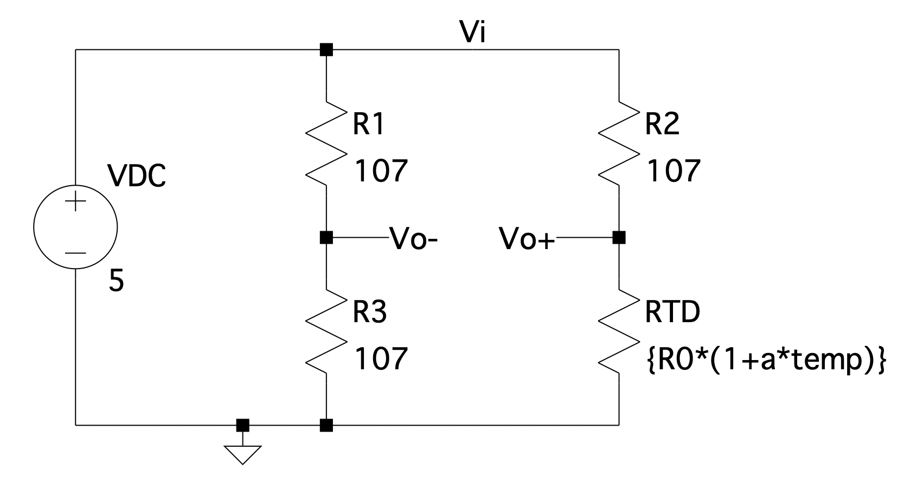
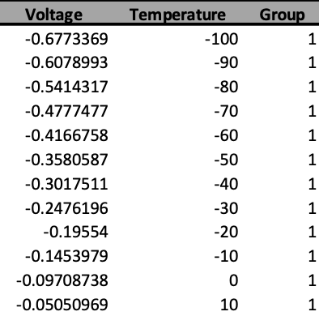
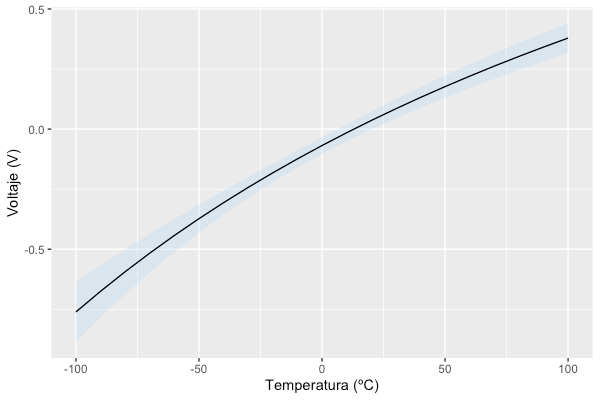
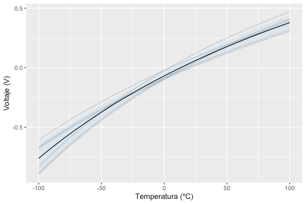

No es la primera vez que he necesitado hacerlo, pero no es algo que necesite hacer muy habitualmente. Hablo de hacer el promedio de curvas o sets de datos. En algún centro de investigación en el que he estado disponían de Origin Pro, que tiene una función muy útil que te hace este trabajo con dos clics y medio; pero en la universidad no disponemos de este _software_ y hago todo el procesado de datos con R. Cada vez que tengo que hacer este tipo de procesado con R... Ay, mi querido R... 😅

En esta entrada, vamos a ver cómo hacer con R ese promedio de sets de datos y cómo extraer otras estadísticas como su desviación estándar.

# Para qué queremos un promedio de curvas

Pues vamos a imaginarnos el siguiente supuesto. Tenemos un sensor que queremos caracterizar. Para ello, cogemos, no solo este sensor, sino muchos, y realizamos múltiples mediciones mientras vamos variando de manera controlada la magnitud que miden. Por ejemplo, vamos a caracterizar un [sensor de temperatura RTD](https://es.wikipedia.org/wiki/RTD), una resistencia cuyo valor varía en función de la temperatura. Un ejemplo de circuito para medir esa variación de resistencia es un [puente de Wheatstone](https://es.wikipedia.org/wiki/Puente_de_Wheatstone).



Circuito de simulación de un puente the Wheatstone con RTD.

Para este ejemplo, he simulado en SPICE una serie de mediciones para una PT100, un sensor muy común y cuyas características puedes encontrar [al final de esta página](https://es.wikipedia.org/wiki/RTD). En estas mediciones, he hecho un barrido en temperatura de -100 a 100 ºC. Además, en cada medición, he variado ligeramente la resistencia nominal a 0 ºC del PT100 y su coeficiente de temperatura (una simulación montecarlo, para los más interesados). Por lo tanto, veremos que, para un mismo rango de temperatura, obtenemos una señal de salida diferente en cada medición. Nuestro objetivo es, de estas mediciones, sacar la media y la desviación estándar para poder estimar una función de transferencia promedio y su error del sensor.

Huelga decirlo, en un caso real los datos los obtendríamos experimentalmente y no mediante una simulación.

# Sets de datos

Antes de ponernos con R, aquí tienes los datos que hemos obtenido ~~de la simulación~~ experimentalmente en la caracterización de nuestro sensor. Cómo verás, tenemos una respuesta que varía según el sensor que utilicemos.


# Promedio de curvas en R

Ahora sí, vamos en materia. Para empezar, veamos cómo tenemos organizado nuestro _data frame_. Este consiste en tres columnas: _Voltage_, _Temperature_ y _Group_. Las dos primeras son claras; hacen referencia a las tensiones y temperaturas medidas. La tercera columna indica el sensor o curva. Así pues, todas las filas con el mismo grupo corresponden a una curva específica. En este caso tenemos 6 grupos o curvas. Este _data frame_ lo tenemos almacenado en la variable `df`.



_Data frame_ con los datos experimentales. Solo se muestran las primeras filas u observaciones.

## Homogeneización de la variable independiente

Lo primero que haremos es algo que justamente ahora no necesitamos porque trabajamos con datos simulados, pero que suele ser común cuando operamos con datos experimentales. Esto es "homogeneizar" la variable independiente (en este caso, la temperatura). ¿Qué quiero decir con esto? En un caso real sería difícil realizar medidas siempre en las mismas temperaturas. En una medida haríamos una medición en 1.7 ºC, 22.5 ºC y 45.9 ºC, y en otra a 1.5 ºC, 25.0 ºC y 44.1 ºC. Pero para hacer la media, necesitamos que haya una medición (voltaje) en cada curva para cada temperatura. Por ello, lo que necesitaríamos hacer es obtener un valor de voltaje para las temperaturas 1.5 ºC, 1.7 ºC, 22.5 ºC, 25.0 ºC, 44.1 ºC y 45.9 ºC para cada uno de los sensores y curvas y, entonces, hacer la media para cada temperatura.

Después, lo que haremos para obtener una medida que no tenemos de un sensor en una temperatura dada es obtenerla mediante interpolación de las dos temperaturas más cercanas.

Vamos a ir paso a paso y vamos a empezar generando un vector con todas las temperaturas utilizadas en todas las mediciones/curvas.

```r
library(ggplot2)
library(dplyr)

# Sensores/curvas. Tenemos 6.
sensors <- seq(1,6)

# Obtenemos todas las temperaturas que se han utilizado durante las mediciones.
approxTemperature <- unique(df$Temperature)
```

## Aproximación de la variable dependiente

Ahora toca que, mediante interpolación, rellenemos esos espacios en blanco entre mediciones para que exista una medida (voltaje) para cada curva/sensor y temperatura.

```r
# Creamos una copia del DataFrame original, pero en blanco.
# Aqui guardaremos las aproximaciones/interpolaciones.
approxDf <- df[0,]

# Recorremos todas las curvas y "rellenamos" los datos blanco entre temperaturas.
for(n in 1:length(sensors)) {

		# Realizamos la interpolacion para el sensor/curva n.
    approxData <- data.frame(
      with(subset(df, Group==sensors[n]),
           approx(
								x=Temperature,
								y=Voltage,
								xout = approxTemperature,
								method = "linear"
						)
      ),
      method = "approx()"
    )

		# Eliminamos una columna method que nos devuelve la funcion y que no queremos.
    approxData$method <- NULL
		# Cambiamos los nombres por defecto de las columnas.
    names(approxData)[names(approxData)=="x"] <- "Temperature"
    names(approxData)[names(approxData)=="y"] <- "Voltage"

		# Añadimos el numero de curva/sensor.
    approxData$Group = sensors[n]

		# Incorporamos la aproximacion al nuevo DataFrame.
    approxDf <- rbind(approxDf, approxData)

}
```

## Promedio y desviación estándar

Finalmente, solo queda ir temperatura a temperatura y calcular el promedio y desviación estándar de todas las curvas/sensores.

```r
# Ahora si, calculamos el promedio y desviacion estandar punto a punto.
approxDf <- approxDf %>%
  group_by(Temperature) %>%
  summarise(avgVoltage = mean(Voltage), sdVoltage = sd(Voltage)) %>%
  arrange(Temperature)
```

## Dibujando los resultados

Si dibujamos los resultados con el siguiente código, nos queda algo tal que así.

```r
# Finalmente, dibujamos los resultado.
transferFunction <-
  ggplot(data = approxDf, mapping = aes(x=Temperature, y=avgVoltage)) +
  labs(
    x = "Temperatura (ºC)",
    y = "Voltaje (V)"
  ) +
  geom_ribbon(aes(ymin = avgVoltage - sdVoltage, ymax = avgVoltage + sdVoltage), alpha=.2, fill="skyblue1") +
  geom_line()

show(transferFunction)
```



La línea negra corresponde a la función de transferencia promedio de nuestro sensor y el área en azul a su desviación estándar. Se espera que al realizar una medida con uno de estos sensores, se obtenga un resultado dentro del área azul con una probabilidad del 68.26% (1σ). Si quisiéramos utilizar un intervalo de mayor confianza (probabilidad del 95%), deberíamos de dibujar 1.96σ.

Para poder ver una pequeña comparación entre el antes y el después, podemos dibujar encima las curvas de cada medición.



# Conclusiones

Hay otros _softwares_ que esto te lo hacen automáticamente o en un par de clics, pero cuando no dispones de estos _softwares_ (como es mi caso), toca hacerlo a mano. En esta entrada hemos visto cómo hacer el promedio de diferentes curvas de caracterización de un sensor, pero es extrapolable a curvas de diferente tipo. De este procesado, aparte de la media, también hemos calculado la desviación estándar. Finalmente, hemos acabado dibujando la curva promedio y el área/intervalo de confianza con un 68.26% de probabilidad o 1σ.

Lo importante: aquí tenemos una chuleta de la que echar mano cuando tengamos que promediar curvas 🤣 ¡Nos vemos en la siguiente entrada!
